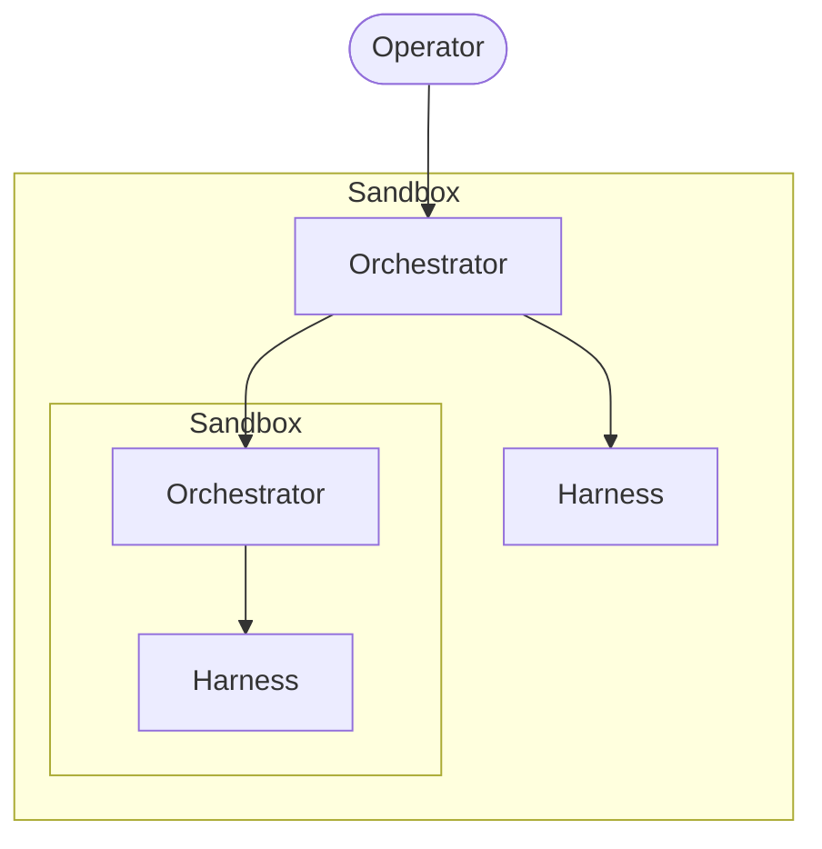

# Four words that made multi-agent click: Operator, Sandbox, Orchestrator, Harness.

:::note

Updated on 2026-10-08. Open Harness is now AGRO. This post uses the current names and commands.

:::

For two years, I called every part of my setup "an agent." The model that typed in my terminal was an agent. The shell script that ran the model was an agent harness. The container around both was also "the agent." I tried to describe my setup to a colleague. The word stopped working in the second sentence.

Then I drew the setup on a whiteboard. The boxes had different shapes. Four shapes did four jobs. My setup felt fragile for one reason. I used one word for four different parts, and I tripped over that word each time I reasoned about the setup.

Here are the four words.

<!-- truncate -->

## Operator

The operator is the human. You are the operator. You own the goal, the deadline, and the taste.

The operator does not write code or run commands directly. The operator *directs* the layer below. The operator is the only layer with a will. Every layer below the operator is a means.

## Sandbox

A sandbox is a property, not a component. The sandbox is the isolation boundary around an agent layer: a container, a worktree, a VM, or a separate machine. The sandbox has exactly one job: **a change inside the sandbox cannot affect the outside until a layer promotes the change explicitly.**

Sandboxes are orthogonal to the rest of the stack. A sandbox wraps a layer. Each layer can have a sandbox. Different layers can have different sandboxes. A sandbox does not *do* work. A sandbox limits what the wrapped layer can break.

## Orchestrator

The orchestrator is the conductor. The orchestrator acts for the operator. The orchestrator reads the goal and splits the goal into tasks. The orchestrator delegates each task to a harness or to a sub-orchestrator, then collects the results.

The defining property of the orchestrator: **the orchestrator does not do the work itself.** The orchestrator coordinates. If your orchestrator writes application code, you have collapsed a layer. You pay for the collapse later, as fragility that nobody can explain.

## Harness

The harness is the leaf. A harness combines an *agent* with the *environment engineering* around the agent. The agent is the LLM, and the LLM does the thinking. The environment engineering is the prompts, tools, context, memory, filesystem, and network access. The harness is the layer that touches reality.

A harness has no children. If you want to give a harness sub-agents, the harness should have been an orchestrator.

## The unlock: orchestrator and harness are the same shape

After I named the four parts, the recursion became clear.

An orchestrator delegates to harnesses. An orchestrator can also delegate to other orchestrators, which delegate to *their* harnesses. The recursion stops at the harness. The harness is the leaf, and the leaf does the real work.

Sandboxes wrap each level independently. The main orchestrator runs in one sandbox. A sub-orchestrator can run in its own sandbox. A harness can share the sandbox of its orchestrator. A harness gets its own sandbox when a sub-task needs full isolation.

That diagram is the whole model. The model has four roles. Two roles, orchestrator and harness, are the same recursive shape at different depths. The sandbox is an isolation property that wraps each layer. The operator is you.

## How this model lives in AGRO

AGRO gives me the clearest worked example:

- **Operator**: me at the keyboard, with the goal.
- **Sandbox**: the Docker container that the orchestrator runs in. Each parallel task gets an isolated git worktree under `.worktrees/`.
- **Orchestrator**: the agent in the first Herdr pane at `/home/sandbox/harness`. The root `AGENTS.md` tells the orchestrator *"do not write application code at the root."* The orchestrator manages git, the sandbox lifecycle, and the shared agent setup.
- **Harness**: a bounded worker that the orchestrator assigns through the `/delegate` skill. Each worker is an LLM with a constrained tool list and a focused assignment. Each worker touches code.

The orchestrator is a harness for *me*. A worker is a harness for the orchestrator. Each layer has the same shape at a different depth, and a sandbox wraps each layer.

Names were the unlock. With the names, I stopped building setups with mysterious bugs. I can now point at the layer that holds the bug.

Do you call every part of your setup "an agent"? Try the four words for a week. Your next setups will be easier to draw. Your current setups will be easier to fix.
