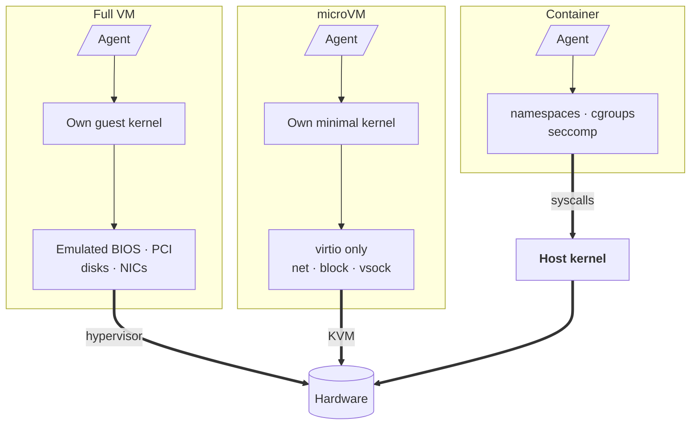
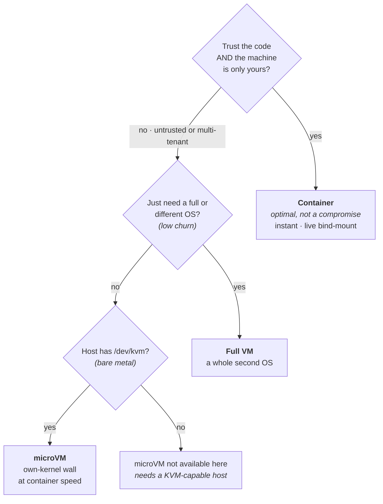

:::note

Updated on 2026-10-08. Open Harness is now AGRO. This post uses the current names and commands.

:::

AGRO runs each coding agent inside a Docker container. The agent can thrash around in the sandbox and never touch your laptop. The question "container or full VM?" had a settled answer: the container wins. Last week, I researched the next contender. Should a Firecracker **microVM** *replace* the container under the agent?

The honest answer was no. The microVM is not weak. Firecracker exists for a job that AGRO does not do yet: untrusted agents for many tenants on shared hardware. For the job that AGRO does, the microVM fits worse. The research made the case for the container as the default even stronger. A microVM takes away the instant, live-editable sandbox that you get when you point the harness at a repo. The research also made me lay out three ways to box in an AI agent. The three boxes are a full VM, a container, and the microVM between the two. Here is the whole mental model.

<!-- truncate -->

## Two axes, three boxes

Each isolation technology trades between two qualities. The first quality is **the strength of the wall** between the workload and the rest of the host. The second quality is **the cost** to put that wall up: boot time, memory, density, and the developer experience inside the wall.

Containers max out the second axis. Full VMs max out the first axis. The microVM is the interesting box, because the microVM does not fully give up either axis. One feature moves along the first axis: the **kernel boundary**. Does the workload get its own kernel, or does the workload share the host kernel?

*One difference drives the rest. The container, which AGRO runs today, shares the **host kernel**. The full VM and the Firecracker microVM each get their own kernel. The microVM keeps a kernel but drops the heavy device model. As the price, the microVM trades the live bind-mount for a virtio-fs or vsock sync.*

## The full VM: the wall that costs the most

A virtual machine asks the hardware to act as a whole second computer. A hypervisor (KVM, VMware, Hyper-V) gives each guest its own kernel, an emulated BIOS, a virtual PCI bus, virtual disks, and virtual NICs. The guest gets the full pantomime of physical hardware. No action of the guest reaches the host kernel, because the guest *has its own kernel*. The full VM gives the strongest isolation in common use.

You pay for that isolation. A full guest boots a full operating system, in seconds or minutes. A guest carries hundreds of megabytes to gigabytes of memory overhead before your workload starts. You fit tens of guests on a host, not thousands. The large device emulation that makes the boundary real is also a large, decades-old attack surface.

Some AI agents start and stop constantly. Other agents launch on demand, per request, by the thousand. For both kinds of agent, that cost disqualifies the full VM. AWS had exactly this problem with Lambda.

## The container: what AGRO runs today

A container is the opposite bet. A container has no second kernel and no emulated hardware. Your agent is a process on the host. Three Linux primitives fence the process off:

- **namespaces**: the process sees its own PIDs, network, and filesystem.
- **cgroups**: the process gets bounded CPU and memory.
- **seccomp and AppArmor**: the kernel denies dangerous syscalls.

A container has no hardware to emulate and no OS to boot. So a container starts in milliseconds and adds almost no memory overhead. You pack hundreds of containers on a host. For a coding agent, one feature matters most: you can **bind-mount your working directory straight in**. The agent edits files, and you see each edit instantly in your editor. No sync layer sits between the agent and you. AGRO uses this feature. On the host, `agro sandbox install docker --checkout <dir>` bind-mounts your checkout at `/home/sandbox/harness` ([`.devcontainer/docker-compose.yml`](https://github.com/mifunedev/agro/blob/v0.18.1/.devcontainer/docker-compose.yml)). An opt-in setting also passes the host Docker socket through, so the agent can run its own containers.

The weak point is the shared kernel. A container is a fence, not a wall. Two specific cracks matter:

- **The socket is root**. The `access.dockerSocket` setting in `agro.json` mounts `/var/run/docker.sock`, so the agent can build and run containers. The setting is off by default. A process with that socket can `docker run` a privileged container that mounts the host's `/`. That one command gives root on your machine.
- **A kernel bug is a host bug.** Each container shares the host kernel. So one kernel CVE or one seccomp bypass hits the host directly. No second boundary stands behind the first boundary.

People recoil at those cracks and miss one point. **For the real job of AGRO, neither crack is a problem**. You run *your own* agent, on *your own* machine, against *your own* code. The threat is not a malicious attacker. The threat is a confused agent that runs `rm` on the wrong directory, and the container contains that mistake completely. Kernel-grade isolation buys nothing here. The isolation costs you the live bind-mount, the instant boot, and the Docker passthrough. Those three features make the sandbox pleasant to use. For this use case, the container is not a compromise. The container is the right answer.

The trust assumptions break only when one assumption flips: the code is not yours, or the machine is not only yours.

## The microVM: a real kernel boundary at container speed

AWS built [Firecracker](https://firecracker-microvm.github.io/) for that flip. Firecracker is the VMM behind AWS Lambda and Fargate. On that platform, Amazon runs millions of functions from strangers on shared hardware. One function must never reach another function.

A Firecracker **microVM** is a real virtual machine. The microVM has its own kernel and a hardware boundary that KVM enforces. The microVM has the strong wall from the VM section. But the microVM drops each feature that made the VM slow. The microVM has no BIOS, no PCI, and no legacy device emulation. The guest gets a minimal set of `virtio` devices (a network interface, a block device, and a vsock pipe) and little else. The result is a VM that **boots in about 125 milliseconds and adds under 5 MB of memory overhead**. These numbers are container-class numbers behind a VM-class boundary. A `jailer` wraps the host-facing VMM process in its own cgroups, namespaces, chroot, and seccomp filter. So even a compromised hypervisor has another fence around it.

The microVM boundary closes exactly the cracks that the container left open. A separate kernel stops a guest kernel exploit at the KVM wall, before the exploit reaches the host. The microVM tier would not mount the Docker socket, so the root escape disappears. One VM per tenant means that a runaway agent of one tenant cannot read the memory or files of another tenant.

The microVM is not free. Most of my research went into a list of the costs:

- **Live editing gets harder.** A microVM cannot bind-mount your host directory the way a container does. Instead, you expose the workspace through `virtio-fs` or a `vsock` file sync. That sync adds a layer between the agent and your files, and the container has no such layer. This cost is the single biggest hit to the developer experience.
- **You need bare metal.** Firecracker requires `/dev/kvm`. Most standard cloud VMs do not expose nested virtualization. So the microVM tier needs a bare-metal host (Equinix, Hetzner dedicated, or an AWS `*.metal` machine). The cheap VPS that a hobbyist already has does not qualify.
- **The microVM does not fix every risk.** A microVM walls off the kernel. A microVM does nothing about a poisoned base image. Supply-chain trust is a separate problem on each row of the table below.

## So which box?

| | Full VM | Container | microVM |
|---|---|---|---|
| Isolation wall | Hardware (own kernel) | Shared kernel + namespaces | Hardware (own minimal kernel) |
| Boot | Seconds–minutes | Milliseconds | ~125 ms |
| Memory overhead | Hundreds of MB–GB | ~Zero | < 5 MB |
| Density per host | Tens | Hundreds–thousands | Thousands |
| Live file editing | Shared-folder, clunky | Native bind-mount | virtio-fs / vsock sync |
| Host requirement | A hypervisor | A Linux kernel | `/dev/kvm` (bare metal) |
| Right when… | You need a full second OS | You trust the code and want speed | You run code that you do not trust |

The decision comes down to one question: **do you trust the code, and is the machine only yours?**

*Supply-chain trust of the base image is a separate problem on each path.*

- **Yes to both**: a developer runs their own agent on their own machine. Pick the container each time. The microVM wall guards against an absent threat. The VM cost buys nothing. Most agent work today fits this case. For this case, the container is not the budget option. The container is optimal.
- **No**: untrusted, model-generated, or third-party agents, especially many tenants on shared hardware. This case is the reason the microVM exists: VM-grade isolation, cheap enough to run per request at fleet scale.
- **Full VM** stays the answer only for low churn and a real need for a whole second operating system. Examples are a different OS or a full device stack. For on-demand agents, the full VM is the wrong shape. Firecracker exists to fill that gap.

## Where this leaves AGRO

AGRO stays on a container. That choice is deliberate, not a default that I never questioned. AGRO centers on one developer, in a terminal, who runs a trusted agent against their own code. For that case, the container is the best box on the board. The container is instant, live-editable, and full-powered. The container also contains the only failure mode that shows up in practice.

The microVM does not replace the container. The microVM is an **added isolation tier** for the case where the trust assumption flips, for example untrusted agents. Since this post, AGRO lists MicroSandbox in its runtime catalog as a planned microVM runtime. `agro sandbox install microsandbox` still exits with an error, and no configuration field selects a runtime other than Docker. See [Runtimes Overview](/docs/agro/runtimes/overview). A microVM that breaks live editing must earn its place against each feature that the container already gives for free. The principle stays clear: pick the box that matches the threat. For the threat that most people have, the container wins.

## Where to run it

This post sets one more axis aside on purpose: *where the container runs*. Isolation is the box around the agent. The host is the machine under that box. The two choices are independent. Your laptop is the fastest way to start, and the best first move. On the laptop, run `agro sandbox install docker`. Then install a coding harness in the sandbox. The better long-term home is a small always-on VM with Docker as its only dependency. Move the same sandbox to that VM. The agent then keeps working on a long task with your laptop lid shut. The agent survives a reboot, and you can reach the agent from each machine that you SSH in from. Note the role of the VM here. The VM is the *host that runs Docker*, not a per-agent isolation wall. The word is the same as for the heavy box above, but the job is the opposite. The container is still the box. The VM only keeps the box powered on.

## Try it

The container sandbox is open source today. Start at the [installation guide](/docs/agro/installation) or the [quickstart](/docs/agro/quickstart). Create a sandbox, install a coding harness, and watch an agent work in a box that starts in seconds. Research on the microVM tier continues in the open. The trade-offs above are the reason that the microVM is a tier and not a replacement.
