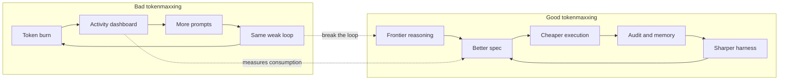
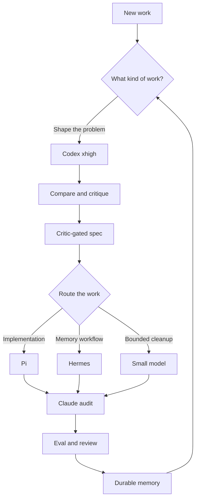

:::note

Updated on 2026-10-08. Open Harness is now AGRO. This post uses the current names and commands.

:::

Tokenmaxxing now gets the hangover treatment. A few months ago, the same behavior looked like aggressive AI adoption. Now the press writes the behavior up as runaway cost. [Pylon's bill jumped into enterprise pricing](https://www.businessinsider.com/pylon-ceo-tokenmaxxing-era-coming-to-end-ai-spend-limits-2026-6). [Fortune called tokenmaxxing a bad ROI metric](https://fortune.com/2026/05/28/tokenmaxxing-is-dead-companies-didnt-get-the-roi-from-ai-they-wanted-to-see/). [WSJ covered the companies that treated tokenmaxxing as survival](https://www.wsj.com/cio-journal/why-some-companies-say-ai-tokenmaxxing-is-key-to-survival-e699a128). [Satya Nadella admitted that the habit is addictive](https://www.windowscentral.com/artificial-intelligence/microsoft-ceo-satya-nadella-says-ai-tokenmaxxing-is-costly-im-a-tokenmaxxer-too-its-addictive).

The obvious lesson: tokens are not output. A leaderboard that rewards the person with the most burned model context is a speedometer on the wrong machine. The leaderboard tells you that activity happened. The leaderboard does not tell you whether the spec improved. The leaderboard does not tell you whether the code survived review, or whether the next run got easier.

But the opposite lesson is also wrong. "Tokenmaxxing is dead" becomes nonsense if the phrase means "stop spending frontier tokens." The useful version is narrower. Spend the expensive tokens where the tokens improve the harness, not where the tokens become the scoreboard.

<!-- truncate -->

## Bad tokenmaxxing

Bad tokenmaxxing is easy to recognize, because the unit of celebration is consumption.

How many tokens did the team burn? How many prompts did each engineer send? How many seats are active? How many generated lines landed? These operational counters have a use, but the counters are terrible success metrics. The counters invite a familiar mistake: a build system judged by CPU minutes instead of shipped, tested behavior.

For agentic engineering, raw token burn misleads even more. A bad agent can spend a fortune on a walk through the repo. The bad agent rewrites the same file and asks a bigger model to summarize its own confusion. A good harness spends a small amount of frontier context to reject a weak plan before any code exists. Then the good harness gives the repetitive work to a cheaper or more project-specific executor.

The difference is not thrift. The difference is the place where the intelligence compounds.

## Good tokenmaxxing

Good tokenmaxxing is frontier comparison that improves a custom harness.

Use the strongest model while the shape of the work is still plastic. In that phase, the model names the problem, compares plans, and finds hidden assumptions. The model writes the acceptance criteria. Adversarial critics attack the spec before the repo must carry the spec. Those tokens do not buy output volume. Those tokens buy fewer bad branches.

AGRO treats Codex `xhigh` this way. I want Codex `xhigh` in the comparison path: ideation, brainstorming, plan comparison, plan shaping with the `/prd` skill, and spec critique. Codex `xhigh` is good at holding multiple possible plans in tension. Codex `xhigh` can also say which plan is simpler. That expensive step belongs upstream of the work.

After that step, more and more implementation should flow through the harness that I build. Implementation should not flow through an endless manual conversation with the frontier model.

## The AGRO split

AGRO is not an enterprise token-governance product, and this post is not a vendor ranking. AGRO is a single-developer harness for one project at a time. The useful question is not "which model wins?" The useful question is "which part of the workflow should carry the most expensive reasoning?"

For this repo, the split has five parts:

**Codex `xhigh` is for comparison**. Codex `xhigh` belongs before commitment, while a change of mind still costs little. Use Codex `xhigh` to generate alternative plans and to critique the plan you like. Also use Codex `xhigh` to tighten the plan and to decide whether the task belongs in the harness at all.

**Pi is the main coding harness when implementation behavior matters**. Pi can hold the project-specific loop: planning mode, task tracking, background monitors, statusline context, Codex usage visibility, and fallback model paths. Do you want to teach the project how the project likes work done? Then Pi is the place to accumulate that behavior.

**Hermes is optional, but Hermes is the right primary harness for memory-heavy operator workflows**. AGRO installs no coding harness at boot, and Hermes is no exception. You install Hermes explicitly with `agro harness install hermes`. Some workflows want persistent memory, self-improving skills, scheduled automation, or Slack and chat operator surfaces. Hermes has a native shape for those workflows. Hermes is not "better than Pi." Hermes has a different center of gravity.

**Claude is for audit, compound, compress, eval, and high-confidence review loops**. In this harness, I still trust Claude for certain review and synthesis passes:

- Claude turns session evidence into durable memory.
- Claude checks whether a change made the harness better.
- Claude compresses context and keeps the load-bearing parts.
- Claude runs the high-confidence audit loop before a PR leaves draft.

**Haiku-class models are for cleanup**. Cleanup means summaries, formatting, low-risk polish, changelog drafts, small transformations, and mechanical copy passes. A task can have a narrow input, a narrow output, and a cheap way to verify the output. Such a task should not rent the biggest brain in the building.

That split can change. That split should change. A harness that cannot route work differently as the tools improve is not a harness. That harness is a habit.

## Where the tokens should go

The expensive model should make the next cheaper run better.

I care about this rule most. Spend frontier tokens on the spec, the critique, the comparison, and the harness behavior that survives the session. Do not spend frontier tokens to inflate a dashboard. Do not spend frontier tokens to make a leaderboard feel alive. An internal graph can reward "AI usage" without proof that the work got safer, clearer, or easier to repeat. Do not spend frontier tokens for that graph.

The practical loop has five steps:

1. Use frontier context to compare approaches.
2. Turn the selected approach into a critic-gated spec.
3. Route implementation through the project harness.
4. Audit the result with a fresh context.
5. Promote the durable lesson back into the harness.

That loop is the tokenmaxxing worth keeping. The tokens disappear, but the harness stays sharper than before.

## Where this leaves AGRO

The right endpoint is not a team that burns more tokens each week. The right endpoint is a harness with less need for heroic frontier sessions, because the harness absorbed the last sessions.

Codex `xhigh` should raise the quality of the comparison and the spec. Pi or Hermes should absorb the project-specific implementation loop. Claude should keep the audit and memory process honest. Smaller models should take the cheap, bounded work.

I want this version of tokenmaxxing. The goal is not maximum token burn as a metric. The goal is to spend the best tokens where those tokens make the harness better at spending the next tokens.
